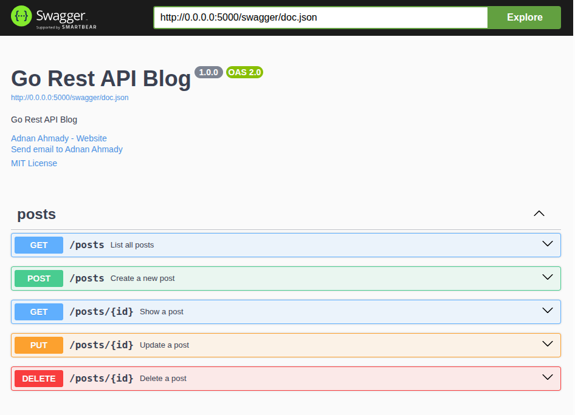

# go-rest-api-blog

A simple RESTful API for a blog, built with **Go**, **Chi**, and **SQLite** as the database.
written with the **Clean architecture** design folowed by **TDD** approach.

## Index
* [Run the application](#run-the-application)
* [Execute the tests](#tests)
* [View the swagger](#swagger-docs)
* [The Project Structure](#the-structure)

## Run The Application

To run the application you can execute the following command in your terminal

```shell
make run
```

## Tests

You can run tests using this command

```shell
make test
```

## Swagger Docs

You can check the swagger of the app using
`http://0.0.0.0:5000/swagger/index.html#/` url.



## The Structure

Your can take a breif look at the project strucutre in bellow.

```shell
.
├── blog.db # database (ignored by git)
├── config # application config
│   ├── loader.go
│   └── structs.go
├── config.yml # default app config values
├── docs # swagger
│   ├── docs.go
│   ├── swagger.json
│   └── swagger.yaml
├── go.mod
├── go.sum
├── .env
├── .env.example
├── .env.testing
├── internal
│   ├── application
│   │   ├── create_usecase.go
│   │   ├── delete_usecase.go
│   │   ├── dtos.go
│   │   ├── list_usecase.go
│   │   ├── show_usecase.go
│   │   └── update_usecase.go
│   ├── domain
│   │   ├── errors.go
│   │   ├── post.go
│   │   └── repositories.go
│   ├── infra
│   │   └── sqlite_post_repo.go
│   ├── integration # api tests
│   │   ├── create_post_test.go
│   │   ├── delete_post_test.go
│   │   ├── factories.go
│   │   ├── list_posts_test.go
│   │   ├── show_post_test.go
│   │   └── update_post_test.go
│   ├── presentation
│   │   ├── v1_handlers.go
│   │   ├── v1_requests.go
│   │   ├── v1_resources.go
│   │   └── v1_routes.go
│   ├── wire_gen.go
│   └── wire.go
├── LICENSE # MIT Licence
├── logs # application logs
│   ├── .gitignore
│   ├── request-2025-11-20.log
│   └── request-2025-11-21.log
├── main.go
├── Makefile # helper commands for working with the application
├── migrations
│   ├── 000001_create_posts_table.down.sql
│   └── 000001_create_posts_table.up.sql
├── pkg
│   ├── app # application helpers. e.g. a function to find app root
│   │   └── info.go
│   ├── applog
│   │   └── logger.go
│   ├── database
│   │   └── connector.go
│   ├── errs # application errors. e.g. 422 response error
│   │   └── app_error.go
│   ├── request
│   │   ├── context.go
│   │   ├── middlewares.go
│   │   └── server.go
│   ├── response
│   │   └── app_response.go
│   └── test # test helpers
│       ├── assertions.go
│       └── setup.go
└── README.md

19 directories, 49 files
```
